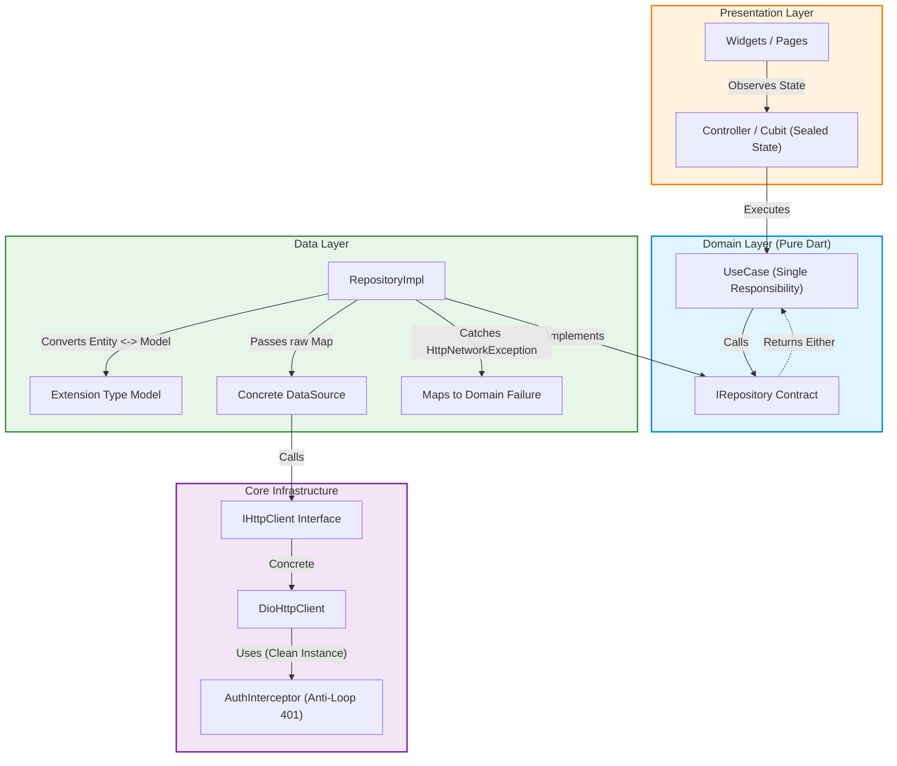

# 🚀 Flutter & Dart Architect (`flutter-dart-architect`)
### The Battle-Tested Clean Architecture Specification for Human Engineers & AI Coding Assistants

[](https://dart.dev)
[](https://flutter.dev)
[](https://opensource.org/licenses/MIT)
[](#-how-to-use-with-ai)

---

## 💡 The Problem: Why Standard AI-Generated Flutter Code Fails

If you have ever asked **ChatGPT, Claude, Cursor, Copilot, or Antigravity** to build a Flutter feature, you have probably seen:
1. **Spaghetti in Widgets**: `Dio` calls, JSON serialization, and SQL queries mixed directly inside `StatefulWidget.build()`.
2. **Infinite 401 Refresh Loops**: Interceptors triggering recursive 401 calls and crashing client sessions when tokens expire.
3. **Bloated DTOs / Models**: Duplicating identical fields between `Entity` and `Model` or polluting domain logic with `toJson()`.
4. **Weak Error Handling**: Throwing generic exceptions, wrapping everything in silent `catch (e) { print(e); }`, and crashing the UI.
5. **Coupled Network Clients**: Data sources directly dependent on concrete third-party packages (`dio`), making testing or client migration impossible.

**`flutter-dart-architect`** fixes this. It is an opinionated, production-grade architectural specification that forces both developers and AI assistants to write robust, testable, decoupled, and clean code.

---

## 🏛️ Architecture Overview



---

## ⚡ The 6 Golden Rules of the Architecture

### 1. Zero-Dependency Functional Error Handling (`Either<Failure, T>`)
No need for heavy packages like `dartz` or `fpdart`. We use a pure, lightweight sealed class:
```dart
sealed class Either<L, R> {
  const Either();
  T fold<T>(T Function(L left) fnL, T Function(R right) fnR);
}
```
Every Repository and UseCase returns `Future<Either<Failure, T>>`, guaranteeing that UI layers handle errors explicitly.

### 2. Models as Dart 3.3+ Extension Types
Never copy-paste fields between Entities and Models.
- **Entity** is pure domain:
  ```dart
  class UserEntity {
    final String id, name, email;
    const UserEntity({required this.id, required this.name, required this.email});
  }
  ```
- **Model** is an **Extension Type** implementing the Entity with zero memory overhead:
  ```dart
  extension type UserModel(UserEntity entity) implements UserEntity {
    factory UserModel.fromJson(Map<String, dynamic> json) => ...;
    Map<String, dynamic> toJson() => ...;
  }
  ```

### 3. Strict Separation: DataSource vs. RepositoryImpl
- **DataSource**: Strictly concrete. Injects `IHttpClient`. Receives raw `Map` / primitive parameters. Returns `HttpResponse<dynamic>`. **Zero `try/catch`**.
- **RepositoryImpl**: Implements domain `IRepository`. Converts Entity to Map. Catches `HttpNetworkException` and maps to `Failure`. Returns `Either<Failure, Entity>`.

### 4. Anti-Loop 401 Auth Interceptor (`cleanDio`)
Prevents infinite refresh loops during 401 unauthorized errors:
- Uses an isolated `cleanDio` instance without interceptors for token renewals (`/auth/refresh`).
- Implements a `Completer<bool>` concurrency lock so multiple parallel 401 responses wait for a single refresh operation.

### 5. Dependency Injection via `AppInjector` + `ServiceLocator`
- Features declare their dependencies in `{Feature}Dependencies.setup(injector)`.
- UI widgets and controllers resolve dependencies via `locator.get<T>()`.
- No direct instantiation of repositories or services in widgets.

### 6. Sealed State & Pattern Matching
- Feature states are modeled using `sealed class {Feature}State`.
- The presentation layer uses exhaustive `switch (state)` without wildcard `default:` branches, guaranteeing compile-time verification when new states are added.

---

## 📂 Project Structure

```
lib/
 ├─ core/                           # Cross-cutting foundational services
 │   ├─ di/                         # ServiceLocator & AppInjector
 │   ├─ error/                      # Either, Failure, Exceptions
 │   ├─ navigation/                 # AppPages, CustomRouter, NavigationController
 │   ├─ network/                    # IHttpClient, HttpResponse, DioHttpClient, Interceptors
 │   ├─ theme/                      # AppColors, AppTheme, AppText
 │   └─ utils/                      # CustomSnack, AppLogger
 ├─ shared/                         # Reusable cross-feature widgets & helpers
 ├─ features/                       # Clean Architecture by Feature
 │    └─ {feature_name}/
 │         ├─ data/                 # datasources, models (extension types), repositories
 │         ├─ domain/               # entities, repository interfaces, usecases
 │         ├─ presentation/         # controllers (sealed state), pages, widgets
 │         ├─ {feature}_routes.dart
 │         └─ {feature}_dependencies.dart
 ├─ app.dart                        # MaterialApp configuration
 └─ main.dart                       # App initialization & entrypoint
```

---

## 🤖 How to Use with AI Assistants

### Option A: Cursor IDE
Copy [`.cursorrules`](./.cursorrules) to the root directory of your Flutter project.

### Option B: Claude Code / Anthropic
Add [`CLAUDE.md`](./CLAUDE.md) to your project root.

### Option C: ChatGPT / Copilot / DeepSeek / Antigravity
Copy the contents of [`prompts/SYSTEM_PROMPT.md`](./prompts/SYSTEM_PROMPT.md) into the custom system instructions or conversation context.

---

## 🧪 Real-World Example

A complete reference implementation is available in [`example/lib/`](./example/lib/):
- Full decoupled network stack (`core/network/`).
- Anti-loop authentication interceptor (`core/network/interceptors/auth_interceptor.dart`).
- Pure functional `Either` implementation (`core/error/either.dart`).
- Auth module showcasing UseCases, Extension Types, DataSources, and Sealed State Controller.

---

## 👤 Author

**Gabriel Amat**  
- GitHub: [@amatgabriel0](https://github.com/amatgabriel0)  
- LinkedIn: [Gabriel Amat](https://linkedin.com/in/gabriel-amat)  
- Email: amat.gabriel0@gmail.com

---

## 📄 License

This project is licensed under the MIT License - see the [LICENSE](./LICENSE) file for details.
