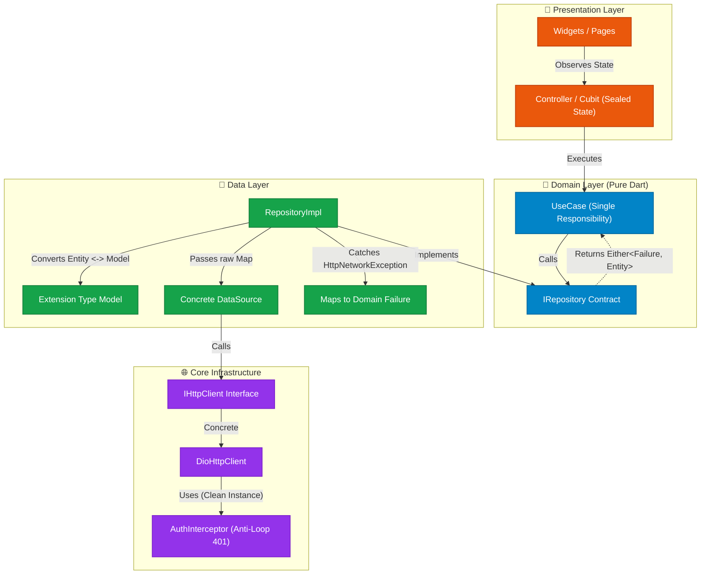

# 🚀 Flutter & Dart Architect (`flutter-dart-architect`)
### The Battle-Tested Clean Architecture Specification for Human Engineers & AI Coding Assistants

[](https://dart.dev)
[](https://flutter.dev)
[](https://opensource.org/licenses/MIT)
[](#-how-to-use-with-ai)

---

## 💡 The Problem: Why Standard AI-Generated Flutter Code Fails

If you have ever asked **ChatGPT, Claude, Cursor, Copilot, or Antigravity** to build a Flutter feature, you have probably seen:
1. **Spaghetti in Widgets**: `Dio` calls, JSON serialization, and SQL queries mixed directly inside `StatefulWidget.build()`.
2. **Infinite 401 Refresh Loops**: Interceptors triggering recursive 401 calls and crashing client sessions when tokens expire.
3. **Bloated DTOs / Models**: Duplicating identical fields between `Entity` and `Model` or polluting domain logic with `toJson()`.
4. **Weak Error Handling**: Throwing generic exceptions, wrapping everything in silent `catch (e) { print(e); }`, and crashing the UI.
5. **Coupled Network Clients**: Data sources directly dependent on concrete third-party packages (`dio`), making testing or client migration impossible.

**`flutter-dart-architect`** fixes this. It is an opinionated, production-grade architectural specification that forces both developers and AI assistants to write robust, testable, decoupled, and clean code.

---

## 🏛️ Architecture Overview



---

## ⚡ The 6 Golden Rules of the Architecture

### 1. Zero-Dependency Functional Error Handling (`Either<Failure, T>`)
No need for heavy packages like `dartz` or `fpdart`. We use a pure, lightweight sealed class:
```dart
sealed class Either<L, R> {
  const Either();
  T fold<T>(T Function(L left) fnL, T Function(R right) fnR);
}
```
Every Repository and UseCase returns `Future<Either<Failure, T>>`, guaranteeing that UI layers handle errors explicitly.

### 2. Models as Dart 3.3+ Extension Types
Never copy-paste fields between Entities and Models.
- **Entity** is pure domain:
  ```dart
  class UserEntity {
    final String id, name, email;
    const UserEntity({required this.id, required this.name, required this.email});
  }
  ```
- **Model** is an **Extension Type** implementing the Entity with zero memory overhead:
  ```dart
  extension type UserModel(UserEntity entity) implements UserEntity {
    factory UserModel.fromJson(Map<String, dynamic> json) => ...;
    Map<String, dynamic> toJson() => ...;
  }
  ```

### 3. Strict Separation: DataSource vs. RepositoryImpl
- **DataSource**: Strictly concrete. Injects `IHttpClient`. Receives raw `Map` / primitive parameters. Returns `HttpResponse<dynamic>`. **Zero `try/catch`**.
- **RepositoryImpl**: Implements domain `IRepository`. Converts Entity to Map. Catches `HttpNetworkException` and maps to `Failure`. Returns `Either<Failure, Entity>`.

### 4. Anti-Loop 401 Auth Interceptor (`cleanDio`)
Prevents infinite refresh loops during 401 unauthorized errors:
- Uses an isolated `cleanDio` instance without interceptors for token renewals (`/auth/refresh`).
- Implements a `Completer<bool>` concurrency lock so multiple parallel 401 responses wait for a single refresh operation.

### 5. Dependency Injection via `AppInjector` + `ServiceLocator`
- Features declare their dependencies in `{Feature}Dependencies.setup(injector)`.
- UI widgets and controllers resolve dependencies via `locator.get<T>()`.
- No direct instantiation of repositories or services in widgets.

### 6. Sealed State & Pattern Matching
- Feature states are modeled using `sealed class {Feature}State`.
- The presentation layer uses exhaustive `switch (state)` without wildcard `default:` branches, guaranteeing compile-time verification when new states are added.

---

## 🏢 Architectural Tiers & Enterprise Scaling

The specification is designed to scale gracefully from single-developer MVPs to multi-squad, mission-critical banking platforms:

- **🟢 Small (MVP & Utilities)**: Minimal layer overhead, native `ValueNotifier`, zero boilerplate.
- **🟡 Medium (Production SaaS / E-commerce)**: Feature-driven Clean Architecture, sealed states, decoupled `IHttpClient`, Extension Types.
- **🔴 Enterprise (Mission-Critical / Banking-Grade)**:
  - **Custom Navigation & Flow Coordinators**: Autonomous navigation stacks that isolate complex wizards (e.g. KYC, Transfers) and allow atomic rollback.
  - **Isolated Scoped Containers (`ScopedContainer`)**: Ephemeral DI lifecycles preventing sensitive state (tokens, account drafts) from leaking across user sessions or flows.
  - **Multi-Package Monorepos (Melos)**: Compile-time isolation across autonomous packages (`packages/core/*`, `packages/features/*`).
  - **Add-to-App (Hybrid Native + Flutter)**: High-performance embedding with `FlutterEngineGroup` (~180KB per instance) and type-safe Pigeon contracts.

👉 **[Read the complete Enterprise Architecture Guide (`docs/PROJECT_SCALES.md`)](./docs/PROJECT_SCALES.md)**

---

## 📂 Project Structure & Reference Architectures

The repository provides 5 complete, runnable reference architectures under [`example/`](./example/):

| Tier | Directory | Specification | Focus Patterns |
| :--- | :--- | :--- | :--- |
| **🟢 Small App** | [`example/small_app/code/`](./example/small_app/code/) | [`project_detail_spec.md`](./example/small_app/project_detail_spec.md) | MVPs, utilities, native `ValueNotifier`, flat clean layout, zero third-party boilerplate. |
| **🟡 Medium App** | [`example/medium_app/code/`](./example/medium_app/code/) | [`project_detail_spec.md`](./example/medium_app/project_detail_spec.md) | Production SaaS, Clean Architecture by Feature, Extension Types, `IHttpClient`, Anti-Loop 401, `CustomSnack`, `main.dart` bootstrap. |
| **🔴 Large / Enterprise** | [`example/large_app/code/`](./example/large_app/code/) | [`project_detail_spec.md`](./example/large_app/project_detail_spec.md) | Banking-grade flows, **Flow Coordinators** (autonomous navigation), **Scoped Containers** (ephemeral memory/session disposal). |
| **📦 Package-Oriented** | [`example/package_oriented/code/`](./example/package_oriented/code/) | [`project_detail_spec.md`](./example/package_oriented/project_detail_spec.md) | Multi-package monorepos with **Melos**, compile boundaries across `core`, `design_system`, and autonomous `feature` packages. |
| **🔌 Add-to-App** | [`example/add_to_app/code/`](./example/add_to_app/code/) | [`project_detail_spec.md`](./example/add_to_app/project_detail_spec.md) | Embedding Flutter into native iOS (Swift) & Android (Kotlin) hosts with **`FlutterEngineGroup`** (~180KB memory) and **Pigeon**. |

---

## 🤖 How to Use with AI Assistants

### 💡 Which file should you use and when?

| Scenario | What to use? | How to use it? |
| :--- | :--- | :--- |
| **In IDEs with file access (Cursor, Antigravity, Claude Code)** | [**`.cursorrules`**](./.cursorrules) or [**`SPEC.md`**](./SPEC.md) | Place `.cursorrules` in your project root, or prompt your agent: *"Read `SPEC.md` and implement feature X"*. |
| **In Web Chat Interfaces (ChatGPT, Claude.ai, Gemini Web)** | [**`prompts/SYSTEM_PROMPT.md`**](./prompts/SYSTEM_PROMPT.md) | Copy and paste the concise rules directly into the *Custom Instructions* / *System Prompt* box without wasting token limits. |
| **For Engineering Teams, Tech Leads & PR Reviews** | [**`SPEC.md`**](./SPEC.md) | Share the complete architectural bible to document the "why" behind every design decision. |

---

### Option A: Pass the Repo Link directly to your AI (Quickest ⚡)
You don't need to install anything. Just share this repository URL with your AI assistant (Gemini, ChatGPT, Claude, Antigravity, GitHub Copilot):
> *"Please design and implement this Flutter feature following the architectural specifications and rules defined in https://github.com/gabriel-amat/flutter_dart_architect"*

### Option B: Cursor IDE
Copy [`.cursorrules`](./.cursorrules) directly into the root directory of your Flutter project.

### Option C: Claude Code / Anthropic
Add [`CLAUDE.md`](./CLAUDE.md) to your Flutter project root.

### Option D: ChatGPT / Gemini / Copilot System Prompts
Copy the contents of [`prompts/SYSTEM_PROMPT.md`](./prompts/SYSTEM_PROMPT.md) into your custom instructions, system prompt, or conversation memory.

---

## 👤 Author

**Gabriel Amat**  
- GitHub: [@gabriel-amat](https://github.com/gabriel-amat)  
- LinkedIn: [Gabriel Amat](https://www.linkedin.com/in/gabriel-amat-dev/)  
- Email: amat.gabriel0@gmail.com

---

## 📄 License

This project is licensed under the MIT License - see the [LICENSE](./LICENSE) file for details.
