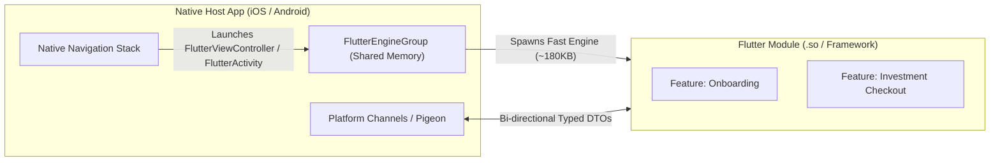

# 📐 Architectural Tiers & Enterprise Patterns

### Practical Guidelines for Small, Medium, and Large-Scale (Mission-Critical) Flutter Applications
*Maintainer: Gabriel Amat | Target: Dart 3.3+ / Flutter 3.19+*

---

## 🧭 Overview of Architectural Tiers

Not every application requires enterprise-grade isolation, but failing to plan for scale can destroy a codebase when your team or product expands. Here is the decision matrix:

| **Metric** | **Small (MVP / Utility)** | **Medium (SaaS / E-commerce)** | **Large / Enterprise (HealthTech, Telecom, ERP, Fintech)** |
| :--- | :--- | :--- | :--- |
| **Team Size** | 1 - 3 developers | 4 - 15 developers | Multiple Squads (20+ engineers) |
| **Code Structure** | Single package, simplified layers | Single package, Clean Architecture by Feature | Multi-package monorepo (Melos) or Modular Packages |
| **State Management** | `ValueNotifier`, `ChangeNotifier` | `Cubit` / `Bloc` with `sealed class` | `Cubit` / `Bloc` with strict unidirectional data flow |
| **Dependency Injection** | Direct injection / simple Locator | Global `AppInjector` + Feature Dependencies | **Scoped Containers** (ephemeral lifecycles per flow/session) |
| **Navigation** | Standard `Navigator` / `Named Routes` | Centralized `NavigationController` + `CustomRouter` | **Flow Coordinators** + Custom Controlled Navigation Stack |
| **Network Layer** | Simple HTTP wrapper | Decoupled `IHttpClient` + Anti-loop 401 | Decoupled `IHttpClient` + SSL Pinning + Dynamic Token Providers |
| **Memory Isolation** | Global singletons acceptable | Singletons with manual cleanup | **Strict Scope Disposals** (zero state leakage between flows/users) |

---

## 🟢 1. Small Tier: MVP & Utilities

### When to Use:
- Proofs of Concept, MVPs, internal tools, or apps with 1-5 screens.
- Goal: Ship fast without incurring over-engineering tax.

### Architecture Guidelines:
- **Flat Feature Structure**: Combine `domain` and `data` when business rules are simple CRUD.
- **State Management**: Use Flutter's native `ValueNotifier` or `ListenableBuilder` to eliminate third-party dependencies.
- **Direct DI**: Constructor injection or a simple lightweight locator.

```
lib/
 ├─ core/
 │   ├─ client/       # Minimal HTTP client
 │   └─ theme/        # Centralized colors & fonts
 ├─ features/
 │   └─ task/
 │        ├─ controllers/
 │        │   └─ task_controller.dart  # ValueNotifier<List<TaskModel>>
 │        ├─ models/
 │        │   └─ task_model.dart       # Model directly serialized
 │        ├─ pages/
 │        │   └─ task_page.dart        # Screen widget
 │        └─ repositories/
 │            └─ task_repository.dart  # Direct repository (HTTP + Storage)
 └─ main.dart
```

---

## 🟡 2. Medium Tier: Multi-Feature Production Apps

### When to Use:
- Scaling startups, multi-feature SaaS, digital retail, apps with 5-30 screens.
- Requires team collaboration, testability, and strict decoupling.

### Architecture Guidelines:
- Follow the core **`flutter-dart-architect`** specification:
  - Full Clean Architecture organized by Feature (`data/`, `domain/`, `presentation/`).
  - **Dart 3.3+ Extension Types** for models (`extension type UserModel(UserEntity) implements UserEntity`).
  - Strict separation: **DataSources** transport raw payloads; **Repositories** translate and handle `HttpNetworkException`.
  - Zero-dependency functional error handling via `Either<Failure, T>`.
  - Decoupled `IHttpClient` with **Anti-Loop 401 Interceptor** (`cleanDio` + `Completer<bool>`).
  - Modular named routes combined in `CustomRouter`.

---

## 🔴 3. Large / Enterprise Tier: Mission-Critical, HealthTech, Telecom & Regulated Systems

### The Challenge of Enterprise Applications:
In complex, high-scale enterprise applications (such as **HealthTech / Telemedicine** with sensitive medical records, **Telecom & SuperApps** with high concurrency, **Logistics & Supply Chain**, **Insurance**, **Enterprise ERPs**, and **Regulated Fintechs**):
1. **State Leakage is a Security & Integrity Violation**: Patient health data, billing sessions, or draft transaction inputs must NEVER survive a logout or leak into another operator's session.
2. **Deep Flows Require Autonomous Stacks**: Multi-step workflows (e.g., Identity Verification / KYC, Emergency Medical Triage, Digital Contract Signing, Insurance Claim Registration) require an autonomous lifecycle with atomic cancellation and teardown of the entire sub-stack without affecting the root navigation history.
3. **Multiple Squads Must Not Conflict**: Squad A, Squad B, and Platform Squad must work independently without shared monolithic classes.

---

### 🏛️ Enterprise Pattern A: The Architectural Quartet (Routes + Coordinator + Injector + Navigator)

To prevent mixing class instantiation, route control, and business orchestration in the same file, each enterprise module strictly encapsulates its responsibilities into **4 dedicated files**:

```
features/{feature_module}/
 ├─ {feature}_routes.dart       # 1. Enum defining internal module routes
 ├─ {feature}_coordinator.dart  # 2. Semantic navigation methods with dedicated navigationKey
 ├─ {feature}_injector.dart     # 3. Isolated dependency registration (initialize / removeAll)
 └─ {feature}_navigator.dart    # 4. StatefulWidget (NavigatorBase) orchestrating lifecycle and sub-screens
```

#### 1. How `NavigatorBase` Orchestrates the Module Lifecycle
The module's `Navigator` is a `StatefulWidget` whose State inherits from `NavigatorBase<T, V>`. It leverages Flutter's native widget callbacks to guarantee **zero memory leaks**:
- **`initState()`**: Calls `injector.initialize()` and registers the Coordinator in `CoordinatorProvider`.
- **`dispose()`**: Calls `injector.removeAll()` (disposing DataSources, Repositories, and Cubits from the Garbage Collector) and unregisters the Coordinator.
- **`build()`**: Builds an isolated `Navigator(key: coordinator.navigationKey)` with a pop observer. When popping the module from the root, the entire widget tree and memory allocations are discarded at once.

#### 2. Sub-Modules in the `switch (route)`: The Key to True Modularity
When a workflow needs to invoke an independent sub-flow (e.g., Identity Verification invoking Facial Biometrics):
1. The Cubit calls `coordinator.goToBiometrics()`.
2. The coordinator pushes `navigationKey.currentState?.pushNamed(Routes.biometrics.path)`.
3. In the `switch (route)` inside `onGenerateRoute`, the case returns **directly the `BiometricNavigator`**:
   ```dart
   case IdentityRoutes.biometrics:
     return MaterialPageRoute(
       builder: (_) => BiometricNavigator(args: BiometricArgs(...)),
     );
   ```
4. The `BiometricNavigator` initializes its own `BiometricInjector`, its `BiometricCoordinator`, and lands on its own base route (`BiometricRoutes.base`), with zero hard coupling to the parent!

#### Orchestration Flow Diagram:
```
[App / Shell Root]
       │
       ▼ push(MaterialPageRoute(builder: (_) => FeatureANavigator()))
[FeatureANavigator (StatefulWidget)]
  ├── initState: injector.initialize() & CoordinatorProvider.add()
  ├── build: Navigator(key: coordinator.navigationKey)
  │     │
  │     ▼ onGenerateRoute: switch (route)
  │         ├── case Routes.base       ==> PageA(cubit: injector.get())
  │         ├── case Routes.document   ==> PageB(cubit: injector.get())
  │         └── case Routes.biometrics ==> MaterialPageRoute(builder: (_) => FeatureBNavigator())
  │                                           │
  │                                           ▼ (Sub-Module with its own lifecycle!)
  │                                      [FeatureBNavigator]
  │                                        ├── initState: featureBInjector.initialize()
  │                                        └── switch (subRoute) ...
  │
  └── dispose: injector.removeAll() & CoordinatorProvider.remove()
```

#### Quartet Reference Code:

```dart
// 1. {feature}_routes.dart (Typed Routes)
enum IdentityRoutes {
  base('/'),
  document('/document'),
  biometrics('/biometrics'); // Route that delegates to another FeatureNavigator!

  const IdentityRoutes(this.path);
  final String path;
}

// 2. {feature}_coordinator.dart (Navigation Semantics)
class IdentityCoordinator extends Coordinator {
  final _navigationKey = GlobalKey<NavigatorState>();

  @override
  GlobalKey<NavigatorState> get navigationKey => _navigationKey;

  Future<void> goToDocument() async =>
      _navigationKey.currentState?.pushNamed<void>(IdentityRoutes.document.path);

  Future<void> goToBiometrics() async =>
      _navigationKey.currentState?.pushNamed<void>(IdentityRoutes.biometrics.path);

  Future<void> finishWithSuccess() async => finishFlow<bool>(true);
}

// 3. {feature}_injector.dart (Memory Isolation)
class IdentityInjector extends InjectorBase {
  final _injector = ModuleInjector();
  final IdentityArgs args;
  IdentityInjector({required this.args});

  @override
  T get<T>() => _injector.get<T>();

  @override
  void initialize() {
    _injector.addLazySingleton<IdentityCubit>(() => IdentityCubit(args));
  }

  @override
  void removeAll() => _injector.removeAll();
}

// 4. {feature}_navigator.dart (StatefulWidget & NavigatorBase)
class IdentityNavigator extends StatefulWidget {
  final IdentityArgs args;
  const IdentityNavigator({super.key, required this.args});

  @override
  State<IdentityNavigator> createState() =>
      _IdentityNavigatorState(IdentityInjector(args: args));
}

class _IdentityNavigatorState
    extends NavigatorBase<IdentityNavigator, IdentityCoordinator> {
  _IdentityNavigatorState(IdentityInjector injector)
      : super(IdentityCoordinator(), injector);

  @override
  Route<dynamic> onGenerateRoute(RouteSettings settings, InjectorBase injector) {
    final route = IdentityRoutes.values.firstWhere(
      (r) => r.path == settings.name,
      orElse: () => IdentityRoutes.base,
    );

    switch (route) {
      case IdentityRoutes.base:
        return MaterialPageRoute(builder: (_) => IdentityIntroPage(cubit: injector.get()));
      case IdentityRoutes.document:
        return MaterialPageRoute(builder: (_) => IdentityDocPage(cubit: injector.get()));
      case IdentityRoutes.biometrics:
        // Directly instantiates another FeatureNavigator with its own keys and injector!
        return MaterialPageRoute(
          builder: (_) => BiometricNavigator(args: BiometricArgs(protocol: widget.args.protocol)),
        );
    }
  }
}
```

---

### 🔒 Enterprise Pattern B: Isolated Scoped Dependency Containers

In mission-critical systems, **global singletons cause memory leaks and security breaches**. Upon exiting a flow or logging out, all memory instances must be discarded immediately.

#### Lifecycle in Hierarchical Scopes:
```
[Global App Scope] (Theme, NetworkClient, DeviceHardwareInfo)
       │
       ▼ User logs in
  [Authenticated Session Scope] (SessionToken, UserProfile, OperationalContext)
         │
         ▼ Starts Verification / Service Flow
    [Ephemeral Flow Scope] (VerificationDraft, FormInputs, FlowControllers)
         │
         ▼ Flow finishes or cancels -> DISPOSE FLOW SCOPE (immediate memory release)
       │
       ▼ Logout -> DISPOSE SESSION SCOPE (destroys tokens and context; Global Scope remains)
```

#### Scoped Container Contract:
```dart
abstract interface class ScopedContainer {
  String get scopeId;

  void registerSingleton<T extends Object>(T Function() factory);
  void registerFactory<T extends Object>(T Function() factory);
  T get<T extends Object>();

  ScopedContainer createChildScope(String childScopeId);
  void dispose();
}
```

When `dispose()` is called on a scope:
- Controllers cancel active subscriptions and streams.
- Cached tokens, draft payment details, and memory references are collected by the GC.
- No stale data can survive into subsequent requests.

---

## 📦 4. Monorepo vs Package-Based vs Add-to-App

When scaling beyond a single codebase, choose between these three architectural strategies:

### 1. Feature-Driven Monorepo (Single Package)
- **Structure**: All code in one repository under `lib/features/`.
- **Best for**: Teams up to 15 developers with unified release cadences.
- **Pros**: Zero package publishing overhead; instant cross-feature refactoring.
- **Cons**: Requires discipline to prevent accidental imports between features.

---

### 2. Multi-Package Architecture (Monorepo with Melos)
- **Structure**: Split codebase into isolated, compile-independent Dart & Flutter packages using **Melos**:
  ```
  my_enterprise_app/
   ├─ melos.yaml
   ├─ apps/
   │   └─ client_app/             # Shell app that glues packages together
   └─ packages/
       ├─ core/
       │   ├─ core_network/        # IHttpClient, DioHttpClient, Interceptors
       │   ├─ core_error/          # Either, Failure, Exceptions
       │   └─ core_security/       # Biometrics, SSL Pinning, Storage
       ├─ design_system/           # Atomic UI components, Themes, Tokens
       └─ features/
           ├─ feature_auth/        # Autonomous Auth package
           ├─ feature_transfers/   # Autonomous Transfers package
           └─ feature_cards/       # Autonomous Cards package
  ```
- **Strict Boundary Rule**: `feature_transfers` CANNOT import `feature_cards`. All cross-feature communication happens via abstract events or core contracts.
- **Benefits**:
  - Independent unit and widget tests per package.
  - Granular CI/CD: only packages with Git changes run test suites.
  - Enforced decoupling: Dart analyzer prevents cross-feature leakage at compile time.

---

### 3. Add-to-App Architecture (Flutter in Legacy Native Apps)

Used when modernizing massive legacy iOS (Swift/Objective-C) and Android (Kotlin/Java) native apps by embedding Flutter modules.



#### Key Rules for Production Add-to-App:
1. **Always Use `FlutterEngineGroup`**:
   - Spawning a standalone `FlutterEngine` consumes ~19MB on iOS and ~25MB on Android.
   - `FlutterEngineGroup` shares common isolates, GPU resources, and fonts, reducing subsequent engine creation to **~180KB memory footprint and sub-millisecond launch times**.
2. **Type-Safe Platform Channels with Pigeon**:
   - Never write raw string-based `MethodChannel.invokeMethod('doSomething', args)`.
   - Use **Pigeon** to generate type-safe Swift, Kotlin, and Dart bindings to eliminate serialization bugs between native and Flutter.
3. **Session & Auth Synchronization**:
   - The native host manages the primary refresh token.
   - Flutter requests the session token from the host on startup and notifies the native host when a 401 logout is triggered.
