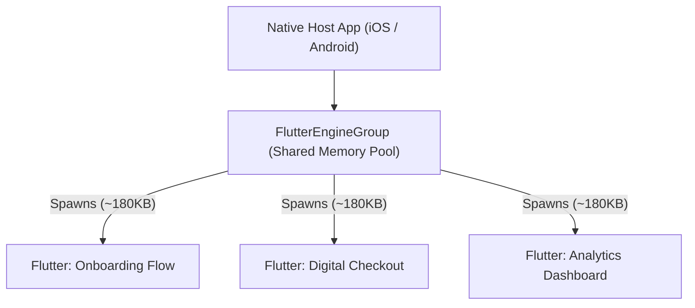

# 🔌 Add-to-App Architecture Specification (`add_to_app`)

### Embedding High-Performance Flutter Modules into Legacy iOS and Android Native Apps
*Maintainer: Gabriel Amat | Target: Dart 3.3+ / Flutter 3.19+*

---

## 🎯 Purpose & Scope

Many established enterprises (banks, telecom, e-commerce) maintain massive native codebases (iOS in Swift/Objective-C and Android in Kotlin/Java). Rewriting the entire app in Flutter from scratch is often financially or operationally impossible.

**Add-to-App** allows teams to develop new high-velocity features in Flutter and seamlessly embed them into existing native screens.

---

## ⚡ The 3 Golden Performance & Safety Rules

### 1. Mandatory: `FlutterEngineGroup` (Memory Pooling)
- **The Problem**: Initializing a standalone `FlutterEngine` consumes ~19MB of RAM on iOS and ~25MB on Android. Spawning multiple engines quickly triggers OOM (Out Of Memory) crashes.
- **The Solution**: Always use `FlutterEngineGroup`. It shares GPU resources, font caches, and isolates across engines:
  - Memory consumption drops from ~19MB to **~180KB per extra engine**.
  - Engine warmup time drops to **sub-millisecond**.



---

### 2. Type-Safe Platform Channels with Pigeon
- **Never write raw strings**: `MethodChannel.invokeMethod('sendToken', args)` leads to silent runtime crashes when native arguments don't match Dart types.
- **Use Pigeon**: Define interfaces in `pigeons/messages.dart`. Pigeon generates strongly typed, compile-checked Swift, Kotlin, and Dart classes.

---

### 3. Bi-Directional Session & Navigation Synchronization
- **Native to Flutter**: The native host provides the authentication token, user ID, and environment (`production`/`staging`) on screen initialization.
- **Flutter to Native**: When a 401 unrecoverable session error occurs in Flutter, it calls the native bridge:
  ```dart
  nativeBridge.onSessionExpired();
  ```
  The native app dismisses the Flutter view controller and redirects to the native login screen.

---

## 📁 Directory Structure

```
my_native_app/
 ├─ ios/                            # Native iOS Xcode Project
 ├─ android/                        # Native Android Studio Project
 └─ flutter_module/                 # Flutter Module created via `flutter create -t module`
     ├─ pigeons/
     │   └─ messages.dart           # Pigeon contract definition
     ├─ lib/
     │   ├─ main.dart               # Default entry point
     │   └─ onboarding_entry.dart   # Dedicated @pragma('vm:entry-point')
     └─ pubspec.yaml
```
