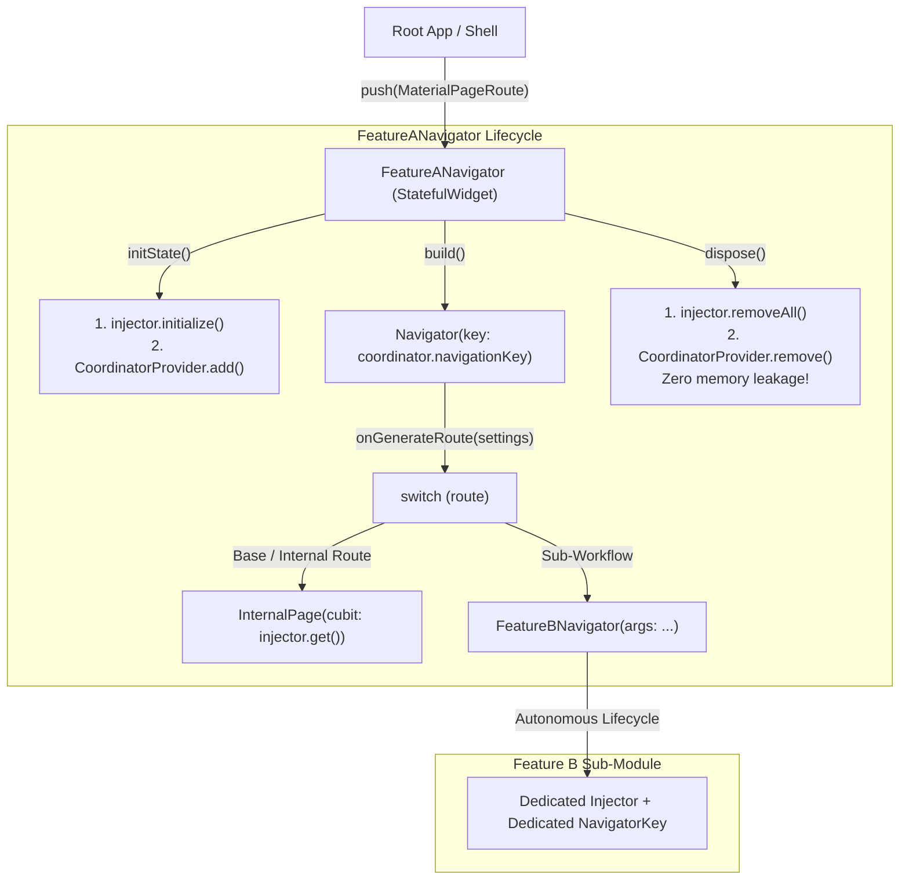

# 🔴 Large / Enterprise App Tier Specification (`large_app`)

### Mission-Critical, HealthTech, Telecom & Enterprise Flutter Architecture
*Maintainer: Gabriel Amat | Target: Dart 3.3+ / Flutter 3.19+*

---

## 🎯 The Enterprise Challenge

In large-scale corporate ecosystems (**HealthTech / Telemedicine**, **Telecom / SuperApps**, **Insurance**, **Global Logistics**, and **Regulated Fintechs**):
1. **Zero Data Leakage**: Sensitive data (patient medical records, facial biometrics, draft contracts, temporary authorization tokens) **must never persist in memory** following flow termination or logout.
2. **Autonomous Lifecycle & Automatic Teardown**: Each multi-step flow must allocate its dependencies, manage its own navigation stack, and upon closing, **automatically release all instances from the Garbage Collector (GC)**.
3. **Sub-Module Orchestration via Isolated Stacks**: A primary feature must be able to invoke independent sub-modules without direct coupling — delegating navigation via routes with seamless transitions between micro-navigators.

---

## 🏛️ The Enterprise Architectural Quartet

To guarantee strict separation of concerns, squad autonomy, and state isolation, every enterprise module implements a cohesive quartet:

```
features/{feature_module}/
 ├─ {feature}_routes.dart       # 1. Enum defining internal module routes
 ├─ {feature}_coordinator.dart  # 2. Semantic navigation methods with dedicated navigationKey
 ├─ {feature}_injector.dart     # 3. Isolated dependency registration (initialize / removeAll)
 └─ {feature}_navigator.dart    # 4. StatefulWidget (NavigatorBase) orchestrating lifecycle and sub-screens
```



---

### 1. `{feature}_routes.dart` (Typed Routes)
Defines an `enum` with all routes recognized internally by the module:

```dart
enum IdentityVerificationRoutes {
  base('/'),
  document('/document'),
  biometrics('/biometrics'); // Route delegating to another FeatureNavigator!

  const IdentityVerificationRoutes(this.path);
  final String path;
}
```

---

### 2. `{feature}_coordinator.dart` (Navigation Semantics)
Inherits from `Coordinator`, owns a private `GlobalKey<NavigatorState>()`, and exposes semantic navigation methods:

```dart
class IdentityVerificationCoordinator extends Coordinator {
  final _navigationKey = GlobalKey<NavigatorState>();

  @override
  GlobalKey<NavigatorState> get navigationKey => _navigationKey;

  Future<void> goToDocument() async =>
      _navigationKey.currentState?.pushNamed<void>(IdentityVerificationRoutes.document.path);

  Future<void> goToBiometrics() async =>
      _navigationKey.currentState?.pushNamed<void>(IdentityVerificationRoutes.biometrics.path);

  Future<void> goBack() async => _navigationKey.currentState?.pop();

  Future<void> finishWithSuccess() async => finishFlow<bool>(true);
}
```

---

### 3. `{feature}_injector.dart` (Memory Isolation & Native Teardown)
Implements `InjectorBase`. Registers DataSources, Repositories, UseCases, and Cubits upon module entry. On teardown, `removeAll()` clears all instances and automatically closes Cubits via `BlocBase.close()`:

```dart
class IdentityVerificationInjector extends InjectorBase {
  final _injector = ModuleInjector();
  final IdentityVerificationArgs args;

  IdentityVerificationInjector({required this.args});

  @override
  T get<T>() => _injector.get<T>();

  @override
  void initialize() {
    _injector.addLazySingleton<IdentityVerificationArgs>(() => args);
    _injector.addLazySingleton<IdentityVerificationCubit>(
      () => IdentityVerificationCubit(args: _injector.get<IdentityVerificationArgs>()),
    );
  }

  @override
  void removeAll() => _injector.removeAll();
}
```

---

### 4. `{feature}_navigator.dart` (StatefulWidget & `NavigatorBase`)
The centerpiece of the architecture. The module's `Navigator` is a `StatefulWidget` whose State inherits from `NavigatorBase`:

```dart
class IdentityVerificationNavigator extends StatefulWidget {
  final IdentityVerificationArgs args;
  const IdentityVerificationNavigator({super.key, required this.args});

  @override
  State<IdentityVerificationNavigator> createState() =>
      _IdentityVerificationNavigatorState(IdentityVerificationInjector(args: args));
}

typedef _NavigatorBaseIdentity =
    NavigatorBase<IdentityVerificationNavigator, IdentityVerificationCoordinator>;

class _IdentityVerificationNavigatorState extends _NavigatorBaseIdentity {
  _IdentityVerificationNavigatorState(IdentityVerificationInjector injector)
      : super(IdentityVerificationCoordinator(), injector);

  @override
  Route<dynamic> onGenerateRoute(RouteSettings settings, InjectorBase injector) {
    final route = IdentityVerificationRoutes.values.firstWhere(
      (r) => r.path == settings.name,
      orElse: () => IdentityVerificationRoutes.base,
    );

    switch (route) {
      case IdentityVerificationRoutes.base:
        return MaterialPageRoute<void>(
          settings: settings,
          builder: (_) => IdentityIntroPage(cubit: injector.get()),
        );

      case IdentityVerificationRoutes.document:
        return MaterialPageRoute<void>(
          settings: settings,
          builder: (_) => IdentityDocumentPage(cubit: injector.get()),
        );

      case IdentityVerificationRoutes.biometrics:
        // 🚀 SUB-MODULE ORCHESTRATION:
        // The Navigator's switch directly returns the next FeatureNavigator.
        // BiometricNavigator builds its own sub-Navigator and lands on BiometricRoutes.base!
        return MaterialPageRoute<void>(
          settings: settings,
          builder: (_) => BiometricNavigator(
            args: BiometricArgs(protocol: widget.args.protocol),
          ),
        );
    }
  }
}
```

---

## 🔄 How the Flutter Lifecycle Guarantees Zero Memory Leaks

Thanks to `NavigatorBase`, development squads do not need to manually manage teardown:

1. **Module Entry (`initState`)**:
   - `injector.initialize()` registers localized dependencies.
   - `CoordinatorProvider.instance.add<V>(coordinator)` registers the coordinator onto the active stack.
2. **Internal Navigation (`build`)**:
   - The widget hosts its own private `Navigator(key: _navigationKey)`.
   - Navigating between internal screens alters **only the private sub-stack**, leaving the root app history untouched.
3. **Module Exit (`dispose`)**:
   - When the flow completes or the user dismisses the flow, `Navigator.pop(context)` unmounts `FeatureNavigator`.
   - Flutter automatically invokes `dispose()`.
   - `NavigatorBase` executes:
     ```dart
     injector.removeAll();
     CoordinatorProvider.instance.remove<V>();
     ```
   - **All memory instances allocated for the flow are immediately reclaimed by the Garbage Collector.**

---

## 📁 Reference Directory Structure (`large_app`)

```
example/large_app/code/lib/
 ├─ core/
 │   ├─ coordinator/
 │   │   ├─ coordinator.dart           # Abstract Coordinator contract (finishFlow, navigationKey)
 │   │   ├─ coordinator_provider.dart  # Global registry and stack of active coordinators
 │   │   └─ navigator_base.dart        # Abstract State joining Navigator + Injector + Lifecycle
 │   └─ di/
 │       └─ injector_base.dart         # Abstract InjectorBase contract & ModuleInjector
 ├─ features/
 │   ├─ identity_verification/
 │   │   ├─ args/identity_verification_args.dart
 │   │   ├─ coordinator/
 │   │   │   ├─ identity_verification_routes.dart
 │   │   │   ├─ identity_verification_coordinator.dart
 │   │   │   ├─ identity_verification_injector.dart
 │   │   │   └─ identity_verification_navigator.dart
 │   │   └─ presentation/
 │   │       ├─ controllers/
 │   │       │   ├─ identity_verification_cubit.dart
 │   │       │   └─ identity_verification_state.dart
 │   │       └─ pages/
 │   │           ├─ identity_intro_page.dart
 │   │           └─ identity_document_page.dart
 │   └─ biometric_validation/          # Autonomous Sub-Module
 │       ├─ args/biometric_args.dart
 │       ├─ coordinator/
 │       │   ├─ biometric_routes.dart
 │       │   ├─ biometric_coordinator.dart
 │       │   ├─ biometric_injector.dart
 │       │   └─ biometric_navigator.dart
 │       └─ presentation/
 │           ├─ controllers/
 │           │   ├─ biometric_cubit.dart
 │           │   └─ biometric_state.dart
 │           └─ pages/
 │               ├─ biometric_intro_page.dart
 │               └─ biometric_capture_page.dart
 └─ main.dart                          # Root shell integrating modules
```

---

## 🤖 AI Coding Assistant Guidelines (Enterprise Tier)

When generating enterprise-tier Flutter code:
1. **Always split each feature into the quartet**: `{feature}_routes.dart`, `{feature}_coordinator.dart`, `{feature}_injector.dart`, and `{feature}_navigator.dart`.
2. **Navigator as a Widget**: `{feature}_navigator.dart` must be a `StatefulWidget` whose State extends `NavigatorBase<T, V>`.
3. **Sub-Modules in the Switch**: To navigate to an independent micro-module, return `MaterialPageRoute(builder: (_) => SubFeatureNavigator(args: ...))` inside the `onGenerateRoute` switch.
4. **Cubit with State Pattern**: Manage screen state via `Cubit<State>` with sealed states (`Initial`, `Loading`, `Success`, `Failure`) without event boilerplate. Cubits are automatically closed via `BlocBase.close()` inside `ModuleInjector.removeAll()`.
5. **Never Use Global `GetIt.instance` in Features**: All feature dependencies belong to `{feature}_injector.dart` and must be disposed in `removeAll()`.
