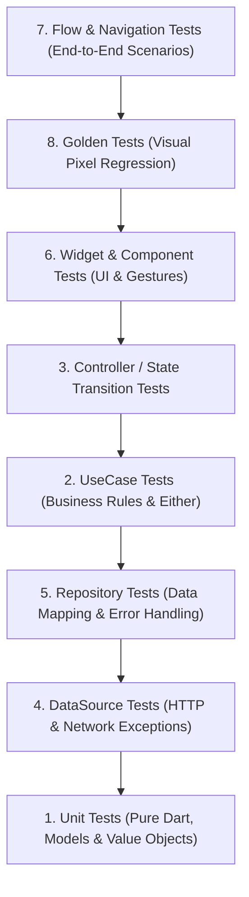

# 🧪 Flutter Testing Guide & Examples (`example/tests`)

### Practical, Concise & Direct Testing Patterns in Flutter
*Maintainer: Gabriel Amat | Target: Dart 3.3+ / Flutter 3.19+*

---

## 🎯 The Testing Philosophy

A production-grade Flutter application requires balanced test coverage across all layers of Clean Architecture. This directory provides direct, minimal, and dependency-free examples of every major test tier.



---

## 📁 Directory Structure

```
example/tests/
 ├─ test/
 │   ├─ 01_unit_test.dart             # Pure Dart logic, models, serialization & equality
 │   ├─ 02_usecase_test.dart          # Clean Architecture UseCase testing with Either<Failure, T>
 │   ├─ 03_controller_test.dart       # State management transitions (Initial -> Loading -> Success/Error)
 │   ├─ 04_datasource_test.dart       # HTTP client verification (endpoints, headers, network exceptions)
 │   ├─ 05_repository_test.dart       # Catching HttpNetworkException & mapping to Failure
 │   ├─ 06_widget_test.dart           # Widget pumping, finding by key/text & user interactions
 │   ├─ 07_flow_navigation_test.dart  # Multi-screen integration test across navigation stacks
 │   └─ 08_golden_test.dart           # Visual regression testing & fixed-viewport layout setup
 ├─ lib/                              # Real, runnable sample Clean Architecture domain code
 └─ pubspec.yaml
```

---

## ⚡ The 8 Testing Tiers Explained

### 1. Unit Tests (`01_unit_test.dart`)
- **Scope**: Pure Dart classes with zero Flutter UI dependencies.
- **What to test**: Value equality, `copyWith()`, `fromJson()`, `toJson()`, string parsing, currency formatting, and business calculations.
- **Speed**: Instantaneous (~1ms).

### 2. UseCase Tests (`02_usecase_test.dart`)
- **Scope**: Core domain business rules.
- **What to test**: 
  - Input validation (returns `Left(ValidationFailure)` before calling repositories).
  - Calling the repository contract and asserting `Right(Entity)`.
  - Handling failure propagations (`Left(ServerFailure)`).

### 3. Controller / State Transition Tests (`03_controller_test.dart`)
- **Scope**: State management (`ValueNotifier`, `Cubit`, or `Bloc`).
- **What to test**:
  - Emitting `LoadingState` immediately upon starting an async action.
  - Transitioning to `SuccessState` or `ErrorState`.
  - Ensuring no duplicate emissions or race conditions.

### 4. DataSource Tests (`04_datasource_test.dart`)
- **Scope**: Low-level transport layer using `IHttpClient`.
- **What to test**:
  - Exact URL paths (e.g. `/users/42`).
  - Query parameters and request body serialization.
  - Verifying that raw exceptions (`HttpNetworkException`) **bubble up directly** without being caught or swallowed in the DataSource.

### 5. Repository Tests (`05_repository_test.dart`)
- **Scope**: Data layer coordinator and deserializer.
- **What to test**:
  - Converting raw `HttpResponse` maps into strongly-typed domain entities.
  - Translating `HttpNetworkException` (404, 500, timeouts) into localized `Failure` subclasses.

### 6. Widget Tests (`06_widget_test.dart`)
- **Scope**: Individual UI components and screens.
- **What to test**:
  - Visual element presence using `find.text()`, `find.byKey()`, `find.byType()`.
  - User interactions: `tester.tap()`, `tester.enterText()`, `tester.drag()`.
  - Callback triggering and conditional widget rendering.

### 7. Flow & Navigation Tests (`07_flow_navigation_test.dart`)
- **Scope**: Multi-screen integration flows.
- **What to test**:
  - Starting on Screen A, entering input, tapping a button.
  - Pushing Screen B onto the navigator.
  - Popping back with `tester.pageBack()` and asserting restored state.

### 8. Golden Tests (`08_golden_test.dart`)
- **Scope**: Visual regression and pixel fidelity.
- **What to test**:
  - Setting a deterministic viewport (`tester.view.physicalSize = Size(400, 200)`).
  - Verifying that component layout does not break across font scaling or theme changes.
  - Comparing against golden master PNG files via `matchesGoldenFile()`.

---

## 🚀 Running All Tests

To execute all test suites across the repository:

```bash
# Run all tests in this package
cd example/tests
flutter test

# Run a specific test suite
flutter test test/01_unit_test.dart
flutter test test/06_widget_test.dart
```
